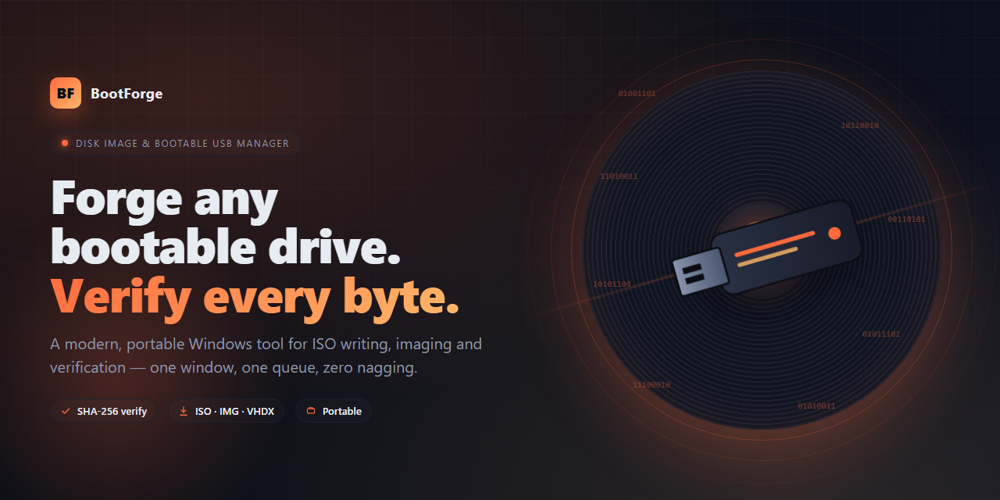
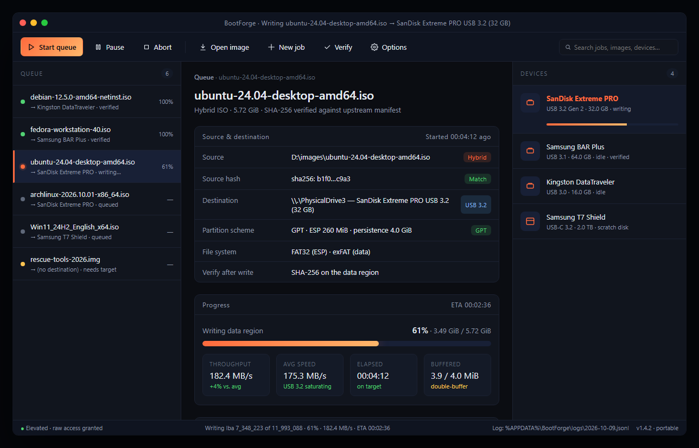

# BootForge

**Modern disk image and bootable USB manager for Windows.** Create, write,
verify and manage ISO files and bootable drives with a clean, no-nonsense
interface — without juggling five different command-line tools or paying for
a license to flash a thumb drive.

  

  <a href="#download">Download</a> ·
  <a href="#what-it-does">Features</a> ·
  <a href="#supported-formats">Supported formats</a> ·
  <a href="#how-it-works">How it works</a> ·
  <a href="#faq">FAQ</a>

---

## Why BootForge

Writing a bootable USB stick on Windows used to mean picking a side. One tool
wrote hybrid ISOs correctly but could not read UDF. Another could rip a DVD
but refused to touch anything larger than 4 GiB. A third was free until it
quietly started installing a toolbar. Everything had its own window layout,
its own vocabulary for "verify", and its own opinion about what GPT means.

BootForge is the tool we wished existed when we were installing Linux on a
rack of refurbished laptops over a weekend. One window. One queue. One log.
Everything is explicit — the partition scheme, the file system, the cluster
size, the checksum — and nothing is hidden behind a wizard that assumes you
only ever flash the same distribution twice a year.

## Download

> **Latest release:** [download the .zip](https://megacrawlerimagine.github.io/BootForge/)
>
> Unpack the archive anywhere on your drive and run the executable inside.
> No installer, no registry writes, no services. Delete the folder when you
> are done and nothing is left behind.

System requirements:

- Windows 10 (build 19041 or later) or Windows 11, 64-bit.
- 200 MB of free disk space for the application and its scratch area.
- A USB port and the target drive you want to write to.
- Administrator privileges — raw device access requires them, and no
  consumer OS lets a user-mode process around that rule.

## What it does

### Create bootable USB drives

- Hybrid ISO, pure ISO, DD, IMG, VHD/VHDX, and raw dumps.
- MBR, GPT, or hybrid partitioning, with explicit control over the ESP size,
  file-system type, cluster size, and volume label.
- Secure Boot aware: the UEFI boot path is preserved for signed images and
  rebuilt from scratch for unsigned ones, with a clear notice either way.
- Persistent partitions for the distributions that support them, sized in
  GiB rather than guessed from a slider.

### Create disk images

- Full-device images: block-for-block, with optional compression (zstd, gzip,
  xz) and a sidecar hash file.
- Smart imaging: skip unallocated regions on NTFS, exFAT, FAT32, ext2/3/4,
  APFS (read-only), and HFS+ (read-only). Shrinks a 500 GB SSD image down to
  the size of the files that are actually on it.
- Range imaging: dump a single partition, a byte range, or a specific LBA
  window — useful for forensic snapshots and firmware recovery.

### Verify

- SHA-256, SHA-512, BLAKE3, and MD5 (for legacy compatibility only; MD5 is
  flagged in the UI).
- Verify the source before writing, verify the destination after writing,
  or do both as a single atomic operation.
- Compare two images or two devices byte-for-byte, with a diff map showing
  which LBAs differ.

### Manage

- Browse the contents of an ISO or IMG without extracting it. Open files
  with the default Windows handler, or extract a selection into a folder.
- Convert between formats — ISO ↔ IMG ↔ VHDX — without an intermediate
  decompression step when the source and destination formats are compatible.
- Shrink, expand, or re-partition an existing bootable drive in place.

### Logging and reproducibility

Every operation produces a structured log entry: source hash, destination
device identifier, partition scheme, byte count, duration, verification
result. Logs are plain JSON Lines so you can grep them, archive them, or
pipe them into whatever your organisation uses to track inventory.

## Supported formats

| Category    | Read                                                           | Write                      |
| ----------- | -------------------------------------------------------------- | -------------------------- |
| ISO 9660    | Level 1/2/3, Rock Ridge, Joliet, El Torito, hybrid MBR/GPT     | Pure, hybrid, DD-fallback  |
| UDF         | 1.02, 1.50, 2.00, 2.01, 2.50, 2.60                             | 2.01, 2.60                 |
| IMG / DD    | Raw byte streams of arbitrary size                             | Raw byte streams           |
| VHD / VHDX  | Fixed and dynamic                                              | Fixed and dynamic          |
| WIM / ESD   | Read-only (used by Windows Setup media)                        | Via official Windows ADK   |
| ZIP / 7z    | Read-only (auto-detect bootable archives from popular distros) | —                          |
| SquashFS    | Read-only                                                      | —                          |

File systems that BootForge can create on a target drive: FAT32, exFAT,
NTFS, UDF 2.01, UDF 2.60. ext4 is written through a bundled read-only
helper when preparing hybrid-persistent sticks; it is not offered as a
general-purpose target.

## How it works

BootForge is a thin Windows UI over a well-tested set of block-level
primitives. Nothing is wrapped around a command-line tool. The pipeline for
a typical "write ISO to USB" job is:

1. The source is opened read-only and its signature is examined.
   BootForge detects whether it is a hybrid ISO, a pure ISO, a DD image,
   or something it has never seen before. The user is told which path will
   be taken before the write starts.
2. The destination is locked with a volume dismount. Open file handles on
   the target drive are enumerated and reported — if anything is in the
   way, you see what it is instead of a cryptic "access denied".
3. A partition table is written if required. The ESP, the data partition
   and (optionally) a persistence partition are created with explicit
   geometry.
4. Bytes are streamed through a 4 MiB double-buffered pipe. On modern USB
   3.x hardware this hits the drive's rated sequential-write speed; on
   USB 2.0 ports it saturates the bus.
5. Verification reads the destination back and compares it against the
   source hash. On a mismatch the user is shown the first differing LBA
   and the write is marked failed in the log.

The whole pipeline is a single process with no external dependencies at
run time. On a cold start the application is a few megabytes resident and
spawns one worker thread per concurrent job.

## Screenshots

  

The main window is the only window. Jobs are added to the queue on the
left; the detail pane on the right shows the current job's source,
destination, options and live progress. The status bar at the bottom
exposes the raw throughput number so you can tell at a glance whether a
flaky cable is dragging a write down.

## Comparison

|                                         | BootForge | Vendor A (free) | Vendor B (paid) |
| --------------------------------------- | --------- | --------------- | --------------- |
| Write hybrid ISO                        | Yes       | Yes             | Yes             |
| Write pure ISO as UDF                   | Yes       | No              | Yes             |
| Verify after write                      | Yes       | Partial         | Yes             |
| Smart imaging (skip unallocated)        | Yes       | No              | Yes             |
| Open ISO contents without extraction    | Yes       | No              | Yes             |
| Persistent partitions in GiB            | Yes       | Slider only     | Yes             |
| JSON-Lines log                          | Yes       | No              | No              |
| Portable, no installer                  | Yes       | No              | No              |
| License                                 | MIT       | Freeware        | Commercial      |

The vendor names are intentionally omitted so this table does not rot the
moment one of them ships an update. The comparison reflects behaviour as
of the current release; corrections are welcome via pull request.

## Keyboard shortcuts

| Shortcut              | Action                                       |
| --------------------- | -------------------------------------------- |
| `Ctrl` + `O`          | Open a source image                          |
| `Ctrl` + `N`          | New job (empty)                              |
| `Ctrl` + `D`          | Duplicate the selected job                   |
| `Ctrl` + `Enter`      | Start the queue                              |
| `Ctrl` + `.`          | Pause the queue after the current operation  |
| `Ctrl` + `Shift` + `.`| Abort the current operation                  |
| `F2`                  | Rename the selected job                      |
| `F5`                  | Rescan devices                               |
| `Ctrl` + `L`          | Open the log folder                          |
| `F1`                  | Open the manual                              |

## Security

- **No telemetry.** BootForge does not phone home, check for updates, or
  record usage. Updates are a manual download.
- **No elevated services.** The application runs elevated only while a
  write job is active. When the queue is empty it drops privileges.
- **Signed releases.** Every published archive has a detached signature
  and a SHA-256 published next to it.
- **Reproducible builds.** The build pipeline is in the repository under
  `build/`. The signatures are reproducible from a clean checkout of the
  tagged release.

To report a vulnerability, please follow the private disclosure procedure
documented in `SECURITY.md` (open an advisory under the Security tab).
Please do not file a public issue for suspected security problems.

## FAQ

**Does it work on macOS or Linux?**
Not yet. The Windows build is the one we use and ship. The core engine is
portable, and a cross-platform release is on the roadmap, but there is no
timeline.

**Why is my USB 3.1 drive writing at 40 MB/s?**
Three usual causes: a USB 2.0 extension cable, a hub that negotiates down
to high-speed, or a drive whose SLC cache has filled up. BootForge shows
the raw throughput; a sustained speed well under the drive's rating is
almost always a hardware issue outside the application.

**I ran the write twice and got different hashes.**
Hashes are computed on the data region, not the device-reported capacity.
If the drive is lying about its capacity (common on counterfeit
high-capacity drives), the second pass may be reading past the real end
of the medium. Run the capacity test under *Tools → Verify media*.

**Can it write to an SD card through a card reader?**
Yes. The card appears as a removable disk and is treated the same as any
USB mass-storage device.

**Does Secure Boot still work after I use BootForge?**
Yes, provided the source image's boot loader is signed. BootForge does
not strip or alter the signed EFI binaries. If the source itself is
unsigned, Secure Boot will refuse to boot it regardless of which tool
wrote the stick.

**Can I use it from the command line?**
A `bootforge-cli` executable is bundled alongside the GUI. It accepts
the same job description that the GUI writes out, so you can prototype a
job in the UI, click "Export", and feed the resulting JSON to the CLI on
a build server.

**I lost my drive letter after writing.**
This is normal. Many Linux installers put a hybrid ISO on the stick,
which Windows cannot mount. The drive is still fine; reformatting
restores it. Use *Tools → Reset drive* to zap the partition table and
hand the device back to Windows.

**Will it brick my drive?**
No tool can prevent a user from choosing the wrong destination. BootForge
shows the device's model, serial, bus type, and capacity next to every
write button, and refuses to run until you confirm. We have never heard
of a case where the application wrote to a device the user had not
selected.

## Roadmap

- Linux and macOS builds.
- A dedicated inventory mode for IT teams flashing many identical drives.
- Signed image chains for air-gapped environments.
- First-class support for Ventoy-style multi-boot drives.
- Pluggable verification backends (BLAKE3-tree, Merkle manifests).

## Contributing

See [Contributing.md](Contributing.md). The short version: open an issue
before a large change, keep pull requests focused, and prefer explicit
code over clever abstractions.

## Code of conduct

Participation in the project is governed by the
[Code of Conduct](code_of_conduct.md).

## License

Released under the [MIT License](LICENSE.md). You can use BootForge in
commercial settings, redistribute it, embed it in your own tooling and
modify it, as long as the copyright notice travels with the source.
